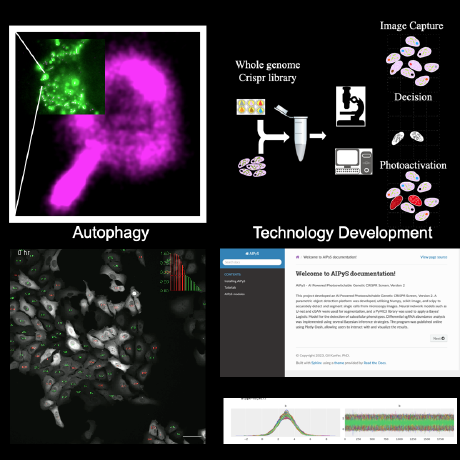

# About me

I am a passionate and driven scientist with a PhD in Biochemistry, boasting 12 years of expertise in data science, machine learning, computer vision, and genomics/metagenomics data analysis. My journey led me to spearhead the development and integration of advancements in deep convolutional network technology for genomic discoveries. My goal is to leverage machine learning and computational methods to substantially enhance human health and well-being.

## Professional Journey

### National Institute of Health, Research Fellow
(1/2020 - Present)
My role involves the cutting-edge intersection of AI and genomics through the AI Powered Photoswitchable Genetic CRISPR Screen project, where I've:
* Developed and published a parametric object detection platform integrating Numpy, scikit-image, and scipy.
* Applied neural network object detection techniques and deployed Bayesian Image classifiers to advance genomic research methodologies.

### National Institute of Health, Post-Doctoral Fellow
(07/2016 - 12/2019)
In these formative years, I:
* Created an R program for robust single-cell detection and segmentation. 
* Built and integrated a CNN cell classifier demonstrating extensive knowledge in neural network model construction.

### Swiss Federal Institute of Technology (ETH) Zurich
(10/2011 - 5/2016) - PhD
During my PhD research, I:
* Focused on molecular biology, proteomics, and biophysics,
* Conducted in-depth studies on mitochondria transport and protein interactions,
* Gained a strong foundation in gene expression and molecular imaging techniques.

## Education
* **PhD, Biochemistry**, Swiss Federal Institute of Technology ETH Zurich, Switzerland
* **M.Sc., Medical Sciences Graduate Studies**, Tel Aviv University, Israel
* **B.Sc., Cellular and Molecular Biology**, Bar Ilan University, Israel
* **Practical Engineering degree, Biotechnology**, Tel Hai Gertrude and Morris Rodman College, Israel

## Skills
* **Programming Languages**: Proficient in Python, R, and MATLAB; experienced in code sharing via Git and Github.
* **Machine Learning and Statistical Analysis**: Deep understanding of both deep learning and conventional machine learning approaches.
* **Genomics**: Expertise in UNIX for gene analysis and handling various NGS platforms.
* **Communication**: Fluent in English and Hebrew, with moderate German and basic knowledge of Spanish and Arabic.

## Mentorship and Leadership
I have mentored numerous students, fostering their growth in machine learning, programming, and genomics, reinforcing my role as a mentor and leader in the scientific community.

## Presentations and Awards
I have been recognized for my contributions to the field with several awards and have actively shared my research findings at prestigious conferences and symposiums globally.

## Contact Me
Gil Kanfer, PhD
11908 Bargate Court, Rockville MD, 20852
Gil.kanfer.il@gmail.com | 301.580.0189

I am eager to explore opportunities where I can apply my extensive knowledge in data science, machine learning, and genomics to make impactful advancements in health and medicine. Please feel free to reach out to discuss potential collaborations or opportunities!